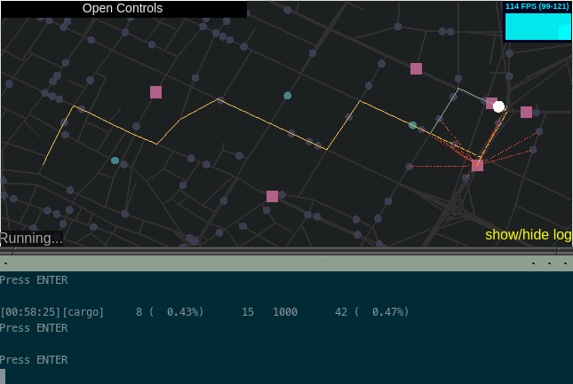

# libcargo (alpha-1)

*Quick Links*

- [Benchmark Instances](https://github.com/jamjpan/Cargo_benchmark)
- TODO [Doc: Getting Started](docs/getting-started.tex)

## Description

Cargo is a C++11 static library and WebGL application for prototyping,
evaluating, and visualizing dynamic ridesharing algorithms.

Ridesharing is a shared mode of personalized transportation where passengers
share a single vehicle to travel from their individual origins to their
individual destinations. The computational problem is to determine which
vehicles should service which passengers toward some objective set by the
ridesharing service provider. The key characteristics of the problem are
that it is online, meaning that future passenger requests are not known
at the time decisions are made, and that it is constrained to a road
network.

Cargo lets researchers quickly prototype ridesharing algorithms and evaluate
them through real-time simulation. It uses two threads, one for advancing the
simulation (T1) and the other for running the algorithm (T2).  An algorithm
`myalg` is hooked into the simulation by calling the `start(myalg)` method of
the `Cargo` class. The `start` method in turn calls `myalg.listen()` on T2,
causing `myalg` to begin periodically polling for new customers and vehicles.
When `listen` encounters a new customer `customer`, it calls
`myalg.handle_customer(customer)`. When it encounters a new vehicle `vehicle`,
it calls `myalg.handle_vehicle(vehicle)`.  Meanwhile on T1, `Cargo` advances
the simulation, updating vehicle positions and other properties.  A Sqlite3
database stores the state of the customers and vehicles and is used by both T1
and T2.

A researcher can extend `RSAlgorithm` and implement `handle_vehicle`,
`handle_customer`, and the other virtual methods in order to prototype a new
ridesharing algorithm.

## Screenshot

Here is `example/grabby` running in real time inside `tmux`.  (ignore the
jumbled text, that is an artifact of terminal capture).  The top pane shows
algorithm output and the bottom shows simulator output (standard out). Under
the hood, special `print` statements within an algorithm are redirected to a
named pipe on the file system that can be consumed using `cat`.

The algorithm `grabby` demonstrates a hybrid top-k greedy algorithm and is
implemented in less than 50 lines of code.

## WebGL Application

The WebGL application uses [THREE.js](https://threejs.org) for
graphics rendering, [node.js](https://nodejs.org) for the backend, and
[socket.io](https://socket.io) for real-time communication with `node`.

The server consumes specially-formatted `*.dat` and `*.feed` (named pipe)
files, generated by Cargo, and sends draw commands to the client
that puts the visuals on its HTML canvas.  Thanks to THREE.js support for GPU
shaders, the client can easily visualize thousands of vehicles (50,000 moving
vehicles at 120 frames per second on my 2016 Lenovo X1 Carbon).

The interface also allows for some interactivity. The `gui` namespace of
`libcargo` provides several functions that users can use to pass drawing
commands to the frontend.  Under the hood, these commands simply print
specially formatted text to standard out. When the web server parses these
texts, it instructs the client to perform the associated drawing command. A
`pause` function can be used to wait on the user before continuing to the next
step of the simulation. These two features are illustrated below. In the user
code, `gui::newroute` is used to draw the yellow route, and `pause` is used to
freeze the real-time running of the simulation and visualization until after
the user presses `Enter` in the server window. The top pane is the browser
and the bottom pane is the separate server window.

## Installation and Usage

TODO See the documentation (`doc`) for installation and usage instructions.

## Roadmap

Ultimately Cargo aims to become a benchmarking tool for ridesharing algorithms.
An application aiming at such a lofty goal as benchmarking should ensure (1) no
algorithm gets any unfair advantage by exploiting some quirk of the tool, and
(2) the benchmark reflects the conditions that an algorithm would encounter in
the real world. The former is accomplished by documenting and verifying exactly
the expected behavior of the library API. The latter can only ever been an
approximation, hence the limitations must be well documented.

Thus on the road map are (1) testing of the API and (2) documentation. Farther
down the line, perhaps (3) new features, such as variable speeds, traffic,
traffic control lights and signs, more accurate streets, ...

## Bugs and Contributing

If you discover a bug, or have a suggestion, please
[Submit an Issue](https://github.com/jamjpan/Cargo/issues/new)!

You can also submit a pull request, against your own branch or against the dev
branch.

## License

Cargo is distributed under the MIT License.

