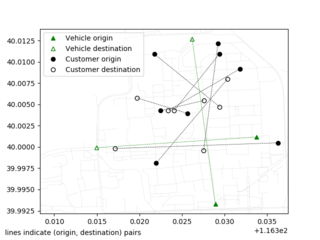
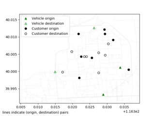
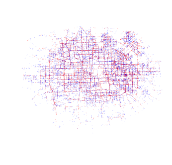

This directoy contains two tools: probplot and probplot_scatter. Maybe in the
future they will be combined into one tool. Both tools output a figure of a
problem instance of the format described in
[Cargo_benchmark](https://github.com/jamjpan/Cargo_benchmark).  The difference
is that probplot creates an interactive figure window and features larger
circles for customers and vehicles, whereas probplot_scatter generates a png
file and uses pixel points for drawing. The intention is that probplot_scatter
be used for larger instances with tens of thousands of vehicles and customers.

Both tools require matplotlib.

Here are the usages:

    usage: probplot [-h] [-i PROB_FILE] [-o OUTPUT] [-l] rnet_file
    usage: probplot_scatter [-h] -i PROB_FILE] [-o OUTPUT] rnet_file

Here are some examples (resized 50% of original).

(customer origins are in red, destinations are in blue)

Note, probplot_scatter can take quite a few minutes. Be patient.

